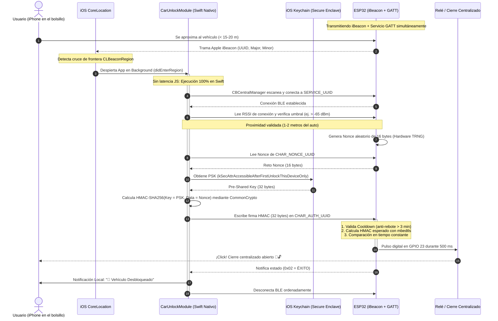

# 🚗 CarUnlock - Sistema de Desbloqueo Automático de Vehículo por Proximidad

Solución integral y de grado de producción diseñada para desbloquear un automóvil automáticamente por proximidad mediante un **iPhone (con pantalla bloqueada / apagada en el bolsillo)** y un microcontrolador **ESP32** conectado al sistema de cierre centralizado.

---

## 📐 Diagrama de Secuencia de Apertura en Segundo Plano



---

## 🗂️ Estructura del Repositorio

```text
CarUnlock/
├── firmware/                        # Firmware C++ para ESP32
│   ├── platformio.ini               # Configuración de compilación PlatformIO
│   ├── include/
│   │   ├── config.h                 # UUIDs, pines GPIO, PSK y constantes
│   │   └── security.h               # Cabecera del subsistema criptográfico
│   ├── src/
│   │   ├── security.cpp             # HMAC-SHA256 (mbedtls), TRNG y tiempo constante
│   │   └── main.cpp                 # Publicidad dual iBeacon+GATT, callbacks y relé
│   └── README.md                    # Instrucciones de flasheo y dependencias
│
├── ios/                             # Módulo Nativo iOS en Swift
│   ├── CarUnlockModule/
│   │   ├── CarUnlockModule.swift    # CoreLocation, CoreBluetooth y ciclo de vida nativo
│   │   ├── KeychainHelper.swift     # Acceso seguro al Keychain con pantalla bloqueada
│   │   ├── CryptoHelper.swift       # Cómputo nativo HMAC-SHA256 con CommonCrypto
│   │   └── CarUnlockBridge.m        # Macro RCT_EXTERN_MODULE para React Native
│   ├── Info.plist                   # Background Modes (location, bluetooth-central)
│   ├── AppDelegate.mm               # Manejo de restauración de estado BLE en AppDelegate
│   └── CarUnlock-Bridging-Header.h  # Cabecera de enlace Swift-ObjC
│
├── mobile/                          # Aplicación React Native (TypeScript)
│   ├── package.json
│   ├── tsconfig.json
│   ├── App.tsx                      # Punto de entrada
│   └── src/
│       ├── types/index.ts           # Definiciones de tipos TypeScript
│       ├── styles/theme.ts          # Sistema de diseño automotriz oscuro
│       ├── native/CarUnlockNative.ts# Puente tipado hacia el módulo nativo
│       ├── components/
│       │   ├── StatusCard.tsx        # Monitor de estado, Bluetooth, Ubicación y RSSI
│       │   ├── SensitivitySlider.tsx # Calibrador de umbral de proximidad (-50 a -85 dBm)
│       │   ├── EventLogList.tsx      # Historial de aperturas y diagnósticos
│       │   ├── PermissionModal.tsx   # Diálogo explicativo de permisos "Siempre"
│       │   └── SecretKeyModal.tsx    # Gestión segura de la clave PSK en Keychain
│       └── screens/HomeScreen.tsx   # Pantalla principal completa
│
└── hardware/                        # Documentación Electrónica y Cableado
    ├── SCHEMATIC.md                 # Esquemático eléctrico, diagrama de bloques y BOM
    └── WIRING_GUIDE.md              # Guía paso a paso de instalación en el vehículo
```

---

## 🔒 Análisis de Seguridad Criptográfica

1. **Prevención de Ataques de Replay (Sniffing BLE):**
   - El ESP32 emite un reto aleatorio criptográfico (**Nonce de 16 bytes**) generado por su generador de números aleatorios por hardware (`esp_fill_random`).
   - Cada Nonce es de **un solo uso** y tiene una validez temporal de 30 segundos. Un atacante que capture la firma transmitida no podrá reutilizarla porque el ESP32 habrá descartado el Nonce.
2. **Comparación en Tiempo Constante:**
   - La verificación del HMAC en el ESP32 (`SecurityManager::constantTimeCompare`) realiza una operación `XOR` sobre todos los bytes sin cortes anticipados, eliminando ataques de canal lateral por análisis de tiempo (*Timing Attacks*).
3. **Almacenamiento Seguro en iPhone:**
   - La clave pre-compartida (PSK) se almacena en el **iOS Keychain** con el atributo de accesibilidad:
     ```swift
     kSecAttrAccessibleAfterFirstUnlockThisDeviceOnly
     ```
     Esto garantiza que la clave permanezca cifrada por hardware en el Secure Enclave y sea accesible por el hilo nativo en segundo plano incluso si el iPhone tiene la **pantalla bloqueada**.
4. **Filtro Estricto de Proximidad Física (RSSI):**
   - Aunque la señal de iBeacon despierte la app a 15-20 metros, la orden de apertura **solo** se ejecuta si la conexión BLE directa reporta una potencia de señal superior al umbral calibrado (ej. `-65 dBm` o ~1.5 metros), previniendo aperturas si el usuario solo pasa cerca del vehículo.
5. **Cooldown / Anti-Rebote:**
   - Tras una apertura exitosa, el ESP32 entra en un temporizador de bloqueo de **3 minutos**. Si el usuario permanece junto al auto conversando o cargando objetos, el sistema ignora intentos adicionales evitando ciclos de apertura y cierre continuos.

---

## 🚀 Puesta en Marcha Rápida

### 1. ESP32
1. Abre la carpeta `firmware` en VS Code con la extensión **PlatformIO**.
2. Modifica la clave `PRE_SHARED_KEY` en `include/config.h` con tu propia secuencia de 64 caracteres hexadecimales.
3. Conecta el ESP32 por USB y ejecuta:
   ```bash
   pio run --target upload
   ```

### 2. React Native & iOS
1. Ingresa a la carpeta `mobile`:
   ```bash
   cd mobile
   npm install
   ```
2. Instala los pods de iOS:
   ```bash
   cd ../ios
   pod install
   ```
3. Ejecuta el proyecto en tu iPhone físico de desarrollo:
   ```bash
   npm run ios -- --device "iPhone de [Tu Nombre]"
   ```
4. Abre la app, pulsa en **"Configurar PSK"** e introduce la misma clave secreta definida en el firmware.
5. Concede los permisos de **Bluetooth** y **Ubicación en modo "Siempre"**.
