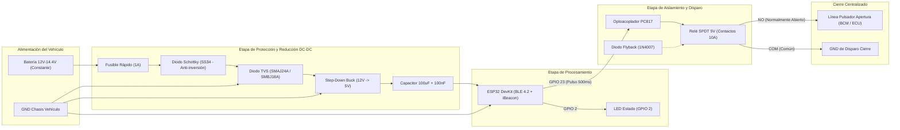

# Diagrama Esquemático y Diseño de Hardware

Este documento describe la arquitectura eléctrica y electrónica completa para conectar el módulo **ESP32** a la red eléctrica del vehículo (12V–14.4V) y al sistema de cierre centralizado de forma segura y con aislamiento galvánico.

---

## 1. Arquitectura General del Sistema



---

## 2. Esquemático Circuital Detallado (ASCII Netlist)

### A. Etapa de Entrada y Acondicionamiento de Energía (12V -> 5V)
Los vehículos presentan ruido severo, fluctuaciones y picos transitorios (*load dump* de hasta +40V cuando el alternador carga). Por ello se requiere protección de grado automotriz:

```
+12V Auto o----- [ FUSIBLE 1A ] ----- [ DIODO SS34 ] ----+--- [ IN+ BUCK ]
                                                          |
                                                    [ TVS 24V ]  (SMAJ24A a GND)
                                                          |
                                                         GND
                                                          
                                                          +--- [ OUT+ 5V ] ----+-----> VIN (ESP32)
                                                          |                    |
                                                     [ 100uF 25V ]       [ 100nF Cerámico ]
                                                          |                    |
GND Chasis o----------------------------------------------+--- [ OUT- GND ] ---+-----> GND (ESP32)
```

- **Fusible 1A:** Protección contra sobrecorriente o cortocircuito.
- **Diodo SS34 (Schottky 3A / 40V):** Protección contra inversión de polaridad.
- **Diodo TVS SMAJ24A:** Suprime picos de voltaje transitorios inductivos.
- **Convertidor Step-Down Buck (ej. MP1584 / LM2596):** Alta eficiencia (>90%), bajo calentamiento y consumo en reposo (*quiescent current*) muy inferior al de un regulador lineal (L7805).

---

### B. Etapa de Disparo con Aislamiento Galvánico (Optoacoplador + Relé)
El pin GPIO 23 del ESP32 entrega 3.3V y no debe interactuar directamente con bobinas inductivas ni con las líneas de 12V de la BCM del auto.

```
                    +5V (Salida Buck)
                     |
                    [ ] Resistencia 1kΩ
                     |
                     +----------------------------+
                     |                            |
ESP32 GPIO 23        |                          [ Relay Coil ]
     |             (1)                         (5V)    |
    [ ] 330Ω       [A]                          |    [ 1N4007 ] (Diodo Flyback)
     |            +-----+                       |      |
     +----------> | 1 4 |-----------------------+------+
                  |     | Optoacoplador                |
                  | 2 3 | PC817                  [ Colector Transistor NPN ]
     +----------> +-----+                        (2N2222 / SS8050)
     |            [K] [E]                              |
ESP32 GND          |   |                               v Emisor
                  GND GND                             GND
```

*Nota:* Si utilizas un **Módulo de Relé estándar de 1 Canal para Arduino/ESP32 con Optoacoplador integrado (Active HIGH)**, este circuito ya viene implementado en la placa PCB con sus respectivas borneras y diodo flyback.

---

### C. Conexión de Contactos Secos al Cierre Centralizado
El 90% de los vehículos modernos operan con **disparo por pulso negativo**:

```
                              RELÉ (Contactos Secos)
                              +--------------------+
                              |                    |
  GND del Vehículo ---------> | COM (Común)        |
                              |                    |
  Cable Señal Desbloqueo ---> | NO (Normal Abierto)|
  (Interior puerta o BCM)     |                    |
                              +--------------------+
```
- En estado de reposo, el contacto `NO` está abierto; el sistema original del auto funciona de manera 100% normal.
- Al activarse el GPIO 23 durante **500 ms**, el relé cierra el contacto, uniendo momentáneamente la línea de desbloqueo a GND, lo que simula la pulsación física del botón interior de apertura.

---

## 3. Lista de Componentes (Bill of Materials - BOM)

| Componente | Especificación / Referencia | Cantidad | Propósito |
| :--- | :--- | :--- | :--- |
| **Microcontrolador** | ESP32 DevKit V1 (ESP-WROOM-32) | 1 | Procesamiento BLE, iBeacon y Crypto |
| **Convertidor DC-DC** | Módulo Buck MP1584EN o LM2596 | 1 | Reducción de 12V a 5.0V estable |
| **Portafusible y Fusible** | Mini Blade Fuse 1A (Automotriz) | 1 | Protección primaria de línea |
| **Diodo TVS** | SMAJ24A o SMBJ18A (Bidireccional) | 1 | Supresión de picos transitorios |
| **Diodo Rectificador** | 1N4007 | 1 | Supresión de fuerza contraelectromotriz (Flyback) |
| **Diodo Schottky** | SS34 o 1N5819 | 1 | Protección de polaridad inversa |
| **Módulo Relé** | 5V SPDT con aislamiento por optoacoplador | 1 | Contacto seco de disparo para la BCM |
| **Capacitores** | 100µF 25V Electrolítico + 100nF Cerámico | 2 | Filtrado y desacoplo de rizado |
| **Gabinete** | Caja plástica ABS ignífuga | 1 | Protección mecánica en habitáculo |
